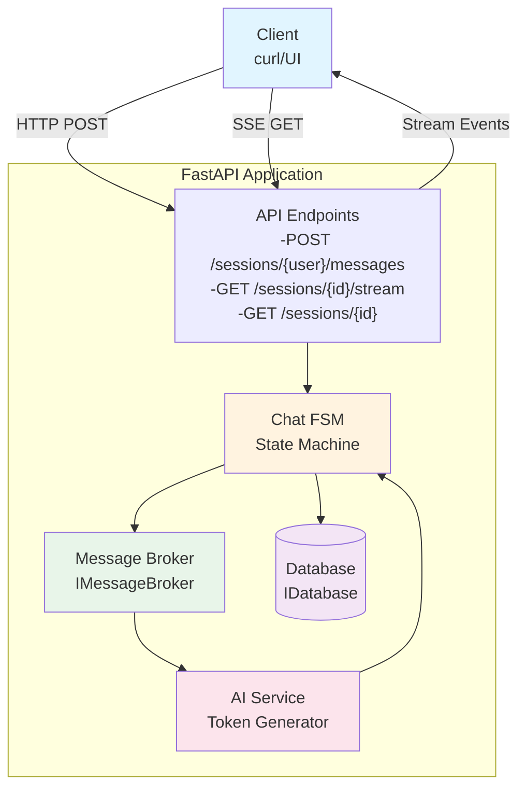

# FSM-Based Chatbot System

A production-pattern demonstration of distributed chatbot coordination using finite state machines, async/sync patterns, and token streaming.


## Overview

This demo project showcases how to build a **stateful, distributed chatbot system** with proper coordination between user input, AI generation, and streaming responses. It employs patterns commonly used in production AI systems while keeping the implementation clean and understandable.

**Key Features:**
- ✅ Finite State Machine (FSM) for turn-based coordination
- ✅ Async optimistic updates with sync commit guarantees
- ✅ Server-Sent Events (SSE) for real-time token streaming
- ✅ Message broker pattern for service decoupling
- ✅ Clean interface abstractions for scalability
- ✅ Production-ready error handling

## The Problem

Multi-turn AI conversations require careful coordination to:

1. **Prevent race conditions** - User shouldn't send messages while AI is generating
2. **Ensure consistency** - What's streamed must match what's saved
3. **Provide responsive UX** - Users want to see responses as they're generated
4. **Enable observability** - Need clear audit trail of what happened when
5. **Support recovery** - Handle failures gracefully without data loss

## The Solution

This system uses:

- **Finite State Machine (FSM)** - Explicit states and validated transitions prevent race conditions
- **Async optimistic updates** - UI feels responsive by updating immediately
- **Sync commit guarantees** - Database writes ensure consistency
- **Message broker pattern** - Decouples API layer from AI processing
- **Server-Sent Events (SSE)** - Real-time token streaming over HTTP

## Architecture


## FSM State Diagram
````mermaid
stateDiagram-v2
    [*] --> IDLE
    
    IDLE --> USER_WRITING: User sends message
    IDLE --> TIMEOUT: Inactivity timeout
    
    USER_WRITING --> USER_COMMITTED: Sync commit success
    USER_WRITING --> ERROR: Commit failed
    
    USER_COMMITTED --> AI_GENERATING: AI picks up work
    USER_COMMITTED --> ERROR: Processing error
    
    AI_GENERATING --> AI_COMMITTED: AI finishes & commits
    AI_GENERATING --> ERROR: Generation failed
    
    AI_COMMITTED --> IDLE: Ready for next turn
    
    ERROR --> IDLE: Retry/Recovery
    TIMEOUT --> IDLE: New message
    
    note right of IDLE
        Ready to accept
        user input
    end note
    
    note right of AI_GENERATING
        Streaming tokens
        to client
    end note
````


### Data Flow

**User Sends Message:**
```
1. Client → POST /messages {user_id, message, session_id?}
2. API → FSM.handle_user_message()
3. FSM → Database.update_state(USER_WRITING)
4. FSM → Database.update_state(USER_COMMITTED)
5. FSM → Broker.enqueue_session(session_id)
6. API → Return {session_id, status: "ok"}
```

**User Receives Response:**
```
7. Client → GET /stream/{session_id} (SSE connection)
8. AI Service (background) → Broker.dequeue_session()
9. AI Service → Generate tokens (mock)
10. AI Service → Broker.send_token(session_id, token)
11. SSE Consumer → Broker.get_session_queue(session_id)
12. SSE Consumer → Stream token to client
13. [Repeat 9-12 for all tokens]
14. AI Service → Database.update_state(AI_COMMITTED)
15. AI Service → Broker.send_event(session_id, "commit_done")
16. SSE Consumer → Stream "commit_done" to client
17. Client → Close SSE connection
```

## Quick Start

### Prerequisites

- Python 3.11+
- pip

### Installation
```bash
# Clone the repository
git clone 
cd fsm-chatbot-demo

# Create virtual environment
python -m venv venv
source venv/bin/activate  # On Windows: venv\Scripts\activate

# Install dependencies
pip install -r requirements.txt
```

### Running the Server
```bash
# Start the FastAPI server
python -m uvicorn src.main:app --reload

# Server will be available at http://localhost:8000
```

### Testing with Examples

**Simple conversation (Python):**
````bash
python examples/simple_conversation.py
````

**Multiple independent sessions:**
````bash
python examples/concurrent_sessions.py
````

**True concurrency test (advanced):**
````bash
python examples/truly_concurrent_sessions.py
````

This demonstrates conversations running simultaneously without interference.


## API Documentation

Once the server is running, visit:
- **Interactive docs:** http://localhost:8000/docs
- **ReDoc:** http://localhost:8000/redoc

### Endpoints

#### `POST /sessions/{user_id}/messages`

Send a message to the chatbot.

**Request:**
```json
{
  "user_id": "alice",
  "message": "Hello!",
  "session_id": "optional-existing-session-id"
}
```

**Response:**
```json
{
  "session_id": "550e8400-e29b-41d4-a716-446655440000",
  "status": "ok",
  "message": "Message received. Connect to /sessions/{session_id}/stream for response."
}
```

#### `GET /sessions/{session_id}/stream`

Stream AI response via Server-Sent Events.

**Response (SSE format):**
```
event: token
data: Hello

event: token
data:  there

event: message_end
data: 

event: commit_done
data: 550e8400-e29b-41d4-a716-446655440000
```

#### `GET /sessions/{session_id}`

Get full session details including message history.

**Response:**
```json
{
  "session": {
    "id": "550e8400-e29b-41d4-a716-446655440000",
    "user_id": "alice",
    "state": "idle",
    "messages": [
      {
        "id": "msg-1",
        "role": "user",
        "content": "Hello!",
        "timestamp": "2024-01-15T10:30:00Z"
      },
      {
        "id": "msg-2",
        "role": "assistant",
        "content": "Hello! How can I help?",
        "timestamp": "2024-01-15T10:30:02Z"
      }
    ],
    "created_at": "2024-01-15T10:30:00Z",
    "updated_at": "2024-01-15T10:30:02Z"
  }
}
```

## Example Usage with curl

**1. Send first message:**
```bash
curl -X POST http://localhost:8000/sessions/alice/messages \
  -H "Content-Type: application/json" \
  -d '{"user_id": "alice", "message": "Hello!"}'

# Response: {"session_id": "", ...}
```

**2. Stream the response:**
```bash
curl -N http://localhost:8000/sessions/{sessionID}/stream

# You'll see tokens streaming in real-time!
```

**3. Send follow-up message:**
```bash
curl -X POST http://localhost:8000/sessions/alice/messages \
  -H "Content-Type: application/json" \
  -d '{"user_id": "alice", "message": "How are you?", "session_id": ""}'
```

**4. Get conversation history:**
```bash
curl http://localhost:8000/sessions/
```

## Design Decisions

### Why FSM?

Finite State Machines provide:
- **Explicit state management** - No ambiguity about what state we're in
- **Validated transitions** - Can't move to invalid states
- **Auditability** - Clear history of state changes
- **Testability** - Easy to test all possible transitions

### Why Async + Sync?

The hybrid approach gives us:
- **Responsive UX** - Optimistic updates make the UI feel fast
- **Strong consistency** - Sync commits ensure data integrity
- **Recovery** - Can always reconstruct state from database

### Why Message Broker?

Message brokers enable:
- **Decoupling** - API and AI service can scale independently
- **Async processing** - Don't block API requests waiting for AI
- **Buffering** - Handle bursts of traffic gracefully
- **Multiple consumers** - Easy to add more AI workers

### Why SSE over WebSockets?

Server-Sent Events are:
- **Simpler** - Unidirectional, just HTTP
- **Firewall-friendly** - Works everywhere HTTP works
- **Auto-reconnect** - Built-in retry logic
- **Sufficient** - We only need server→client streaming

## Production Considerations

This is a demo with in-memory implementations. For production:

### Database
**Current:** `InMemoryDatabase` (dict-based)  
**Production:** PostgreSQL, MongoDB, or DynamoDB
```python
# Easy swap via dependency injection
from postgres_database import PostgresDatabase
db = PostgresDatabase(connection_string)
fsm = ChatFSM(db, broker)  # Everything else stays the same
```

### Message Broker
**Current:** `InMemoryBroker` (queue-based)  
**Production:** Redis, RabbitMQ, or Kafka
```python
from redis_broker import RedisBroker
broker = RedisBroker(redis_client)
```

### AI Service
**Current:** Mock token generation  
**Production:** Real LLM integration (OpenAI, Anthropic, etc.)
```python
async def _generate_response(self, prompt: str):
    # Replace mock with real LLM call
    async for token in anthropic_client.stream(prompt):
        yield token
```

### Scaling
- **Horizontal scaling** - Run multiple API and AI service instances
- **Load balancing** - Nginx or cloud load balancer
- **Session affinity** - Not required due to shared state (DB/broker)

### Monitoring
- **Observability** - Add OpenTelemetry for distributed tracing
- **Metrics** - Track state transition times, queue depths
- **Alerting** - Monitor stuck sessions, error rates

### Timeout Detection

The system tracks `session.updated_at` on every state transition, enabling timeout detection:
```python
# Production: Background job runs every 60s
stuck_sessions = db.query("""
    SELECT * FROM sessions 
    WHERE state IN ('user_writing', 'ai_generating')
    AND updated_at < NOW() - INTERVAL '30 seconds'
""")

for session in stuck_sessions:
    await fsm.mark_error(session.id, "Session timeout")
```

### Security
- **Authentication** - Add JWT or OAuth
- **Rate limiting** - Prevent abuse
- **Input validation** - Sanitize user messages
- **CORS** - Configure allowed origins

## Interface Design

All core components use abstract interfaces, making it trivial to swap implementations:
```python
# Defined once
class IDatabase(ABC):
    @abstractmethod
    async def get_session(self, session_id: str) -> Optional[Session]: ...

# Swap implementations with zero code changes
db = InMemoryDatabase()      # Development
db = PostgresDatabase(...)    # Production
db = MockDatabase()          # Testing

fsm = ChatFSM(db, broker)    # Same code works with all implementations
```

## Technologies

- **FastAPI** - Modern Python web framework with automatic OpenAPI docs
- **Uvicorn** - Lightning-fast ASGI server
- **Pydantic** - Data validation and serialization
- **Python asyncio** - Async/await patterns for concurrency

## Project Structure
## Project Structure
````
fsm-chatbot-demo/
├── src/
│   ├── __init__.py
│   ├── models.py              # Data models and enums
│   ├── interfaces.py          # Abstract interfaces
│   ├── database.py            # In-memory database implementation
│   ├── broker.py              # In-memory broker implementation
│   ├── fsm.py                 # Core FSM logic
│   ├── ai_service.py          # Background AI worker
│   └── main.py                # FastAPI application
├── examples/
│   ├── simple_conversation.py           # Python basic example
│   ├── concurrent_sessions.py           # Multiple sessions demo
│   └── truly_concurrent_sessions.py     # True parallelism test
├── requirements.txt
├── .gitignore
└── README.md
````


## Testing

### Manual Testing

Run the example scripts:
```bash
./examples/simple_conversation.sh
python examples/simple_conversation.py
python examples/concurrent_sessions.py
```

### Future: Automated Tests
```python
# tests/test_fsm.py (example structure)
async def test_valid_state_transitions():
    db = InMemoryDatabase()
    broker = InMemoryBroker()
    fsm = ChatFSM(db, broker)
    
    session = await fsm.handle_user_message("user1", "Hello")
    assert session.state == SessionState.USER_COMMITTED
    
    # ... more assertions
```

## What This Demonstrates

### Technical Skills
✅ Clean interface abstractions (dependency injection)  
✅ Proper separation of concerns (FSM, DB, Broker, API)  
✅ FSM discipline for state management  
✅ Production patterns (async/sync, queuing, streaming)  
✅ Error handling and edge cases

### Systems Thinking
✅ Understands distributed coordination  
✅ Knows when to use queues vs direct calls  
✅ Thinks about scaling from the start  
✅ Designs for testability and swappable implementations

### Pragmatism
✅ Mocks appropriately (no over-engineering)  
✅ Focuses on demonstrating patterns, not perfection  
✅ Documents design decisions clearly  
✅ Shows "production-ready mindset" even in demo

## Author

Built by Aris Gioutlakis as a demonstration of distributed systems patterns for AI chatbot coordination. Based on production systems built for multi-agent orchestration.

**Contact:** arissafaris@gmail.com  
**LinkedIn:** https://www.linkedin.com/in/aris-gioutlakis-14a037386/

## License

MIT License - Feel free to use this as a reference or starting point for your own projects.

---

**Questions or feedback?** Open an issue or reach out directly!
